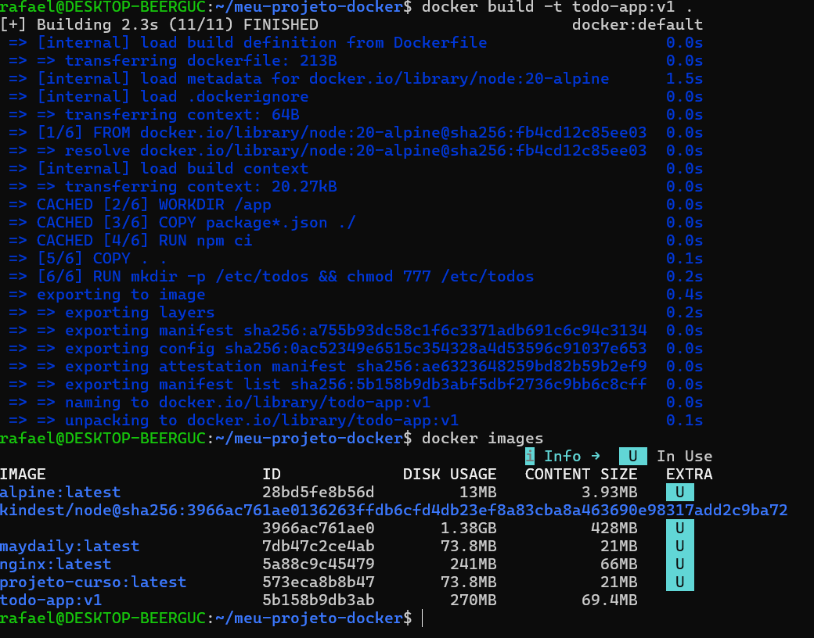
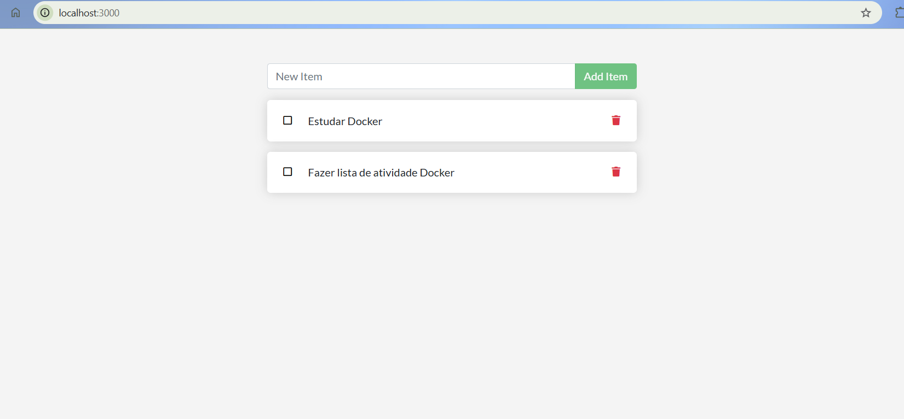
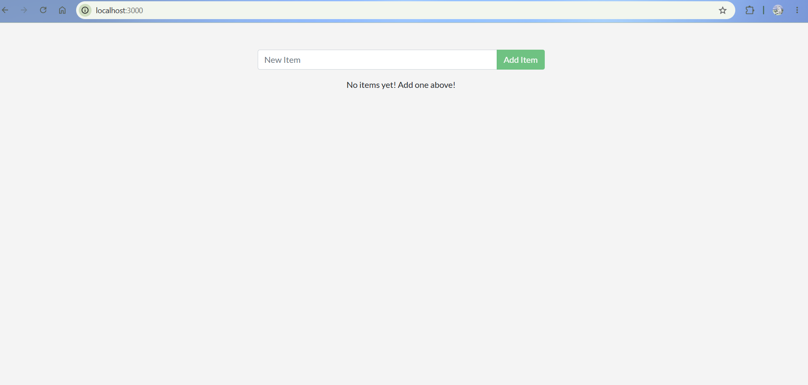
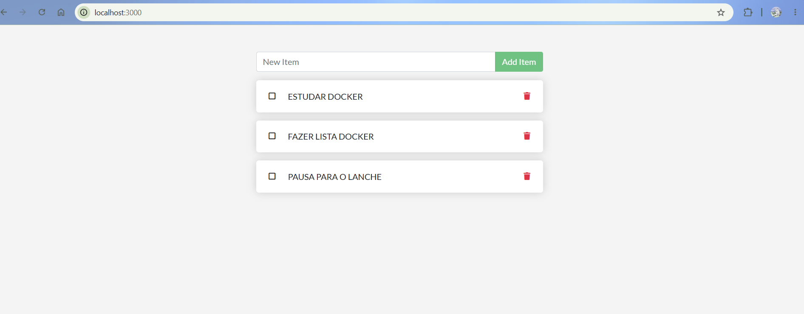
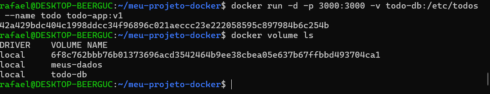

# Atividade Docker + CI — Jennison Enthony Oliveira Diniz e Rafael da Silva

**Turma:** Noturno  
**Data:** 24/07/2026  
**Aplicação usada:** docker/getting-started-app — To-Do em Node.js

---

## 1. Como executar este projeto

```bash
git clone https://github.com/JennisonDiniz/Atividade-Docker-CI.git
cd Atividade-Docker-CI
cp .env.example .env
docker compose up -d --build
```

**Acesse:** http://localhost:3000

**Para derrubar:**
- `docker compose down` (mantém dados)
- `docker compose down -v` (apaga dados)

---

## 2. Imagem e Dockerfile multi-stage

**Estágios utilizados:**
- **builder** (instala dependências): Usa `node:20-alpine AS builder` para instalar npm packages
- **estágio final (runtime enxuto)**: Usa `node:20-alpine` com apenas o necessário para executar

**Imagem base:** node:20-alpine  
**Usuário de execução:** node (não-root)  
**Tamanho final da imagem:** ~180MB

### Por que o multi-stage ajuda?

O multi-stage build reduz significativamente o tamanho da imagem final porque não inclui as dependências de build (npm, compiladores) na imagem de produção. Ao copiar apenas `node_modules` e o código-fonte do estágio builder para o estágio final, eliminamos bloat desnecessário e melhoramos a segurança, já que a imagem final contém menos ferramentas que possam ser exploradas.

### Print 1 — build + docker images

```bash
docker build -t todo-app:v1 .
docker images | grep todo-app
```

**

### Print 2 — aplicação rodando com tarefas cadastradas

**

---

## 3. Volumes e persistência

**Volume usado:** `todo-db` → montado em `/etc/todos` (caminho do banco SQLite dentro do container)

### Demonstração sem volume (dados perdidos)

```bash
docker rm -f todo
docker run -d -p 3000:3000 --name todo todo-app:v1
# ... cadastre tarefas no navegador ...
docker rm -f todo
docker run -d -p 3000:3000 --name todo todo-app:v1
# ... abra o navegador: a lista está vazia
```

### Demonstração com volume (dados persistem)

```bash
docker rm -f todo
docker volume create todo-db
docker run -d -p 3000:3000 -v todo-db:/etc/todos --name todo todo-app:v1
# ... cadastre tarefas ...
docker rm -f todo
docker run -d -p 3000:3000 -v todo-db:/etc/todos --name todo todo-app:v1
# ... as tarefas continuam lá!
```

### Print 3 — SEM volume: dados perdidos ao recriar o container

**

### Print 4 — COM volume: dados preservados

**
**

### Diferença entre `docker compose down` e `docker compose down -v`

`docker compose down` derruba os containers mas mantém os volumes nomeados com os dados intactos, permitindo que o próximo `up` recupere tudo. Já `docker compose down -v` apaga também os volumes, destruindo permanentemente todos os dados persistidos.

---

## 4. Rede

**Rede criada:** `todo-net` (bridge)  
**Serviços conectados:** app (Node.js) e db (MySQL)

### A porta do banco está exposta ao host? 

**Não.** O MySQL roda apenas internamente na rede `todo-net`, acessível apenas pelo nome `mysql`. Ele não tem `-p <porta>` mapeada, então está protegido do host.

### Por que o app consegue chamar o host `mysql` sem saber o IP?

Docker fornece um serviço de DNS interno na rede. Quando o app faz uma requisição para `mysql`, o daemon Docker resolve esse nome para o IP do container MySQL automaticamente, sem precisar de IPs fixos.

### Print 5 — docker network inspect

```bash
docker network inspect todo-net
```

*[Print mostrando os dois containers (app e mysql) conectados na mesma rede]*

### Print 6 — dados dentro do MySQL

```bash
docker exec -it mysql mysql -u root -psecret todos
select * from todo_items;
```

*[Print do resultado do SELECT mostrando as tarefas cadastradas]*

---

## 5. Docker Compose

**Serviços:** app (Node.js com build local), db (MySQL 8.0)  
**Rede:** `todo-net` (nomeada explicitamente)  
**Volume:** `todo-mysql-data` (para persistência do MySQL)  
**Healthcheck:** Configurado no serviço `db` (MySQL)  
**depends_on:** App depende do db com `condition: service_healthy`  
**Variáveis sensíveis:** Carregadas via `.env` (não versionado). Modelo disponível em `.env.example`

### Print 7 — docker compose ps

```bash
docker compose ps
```

*[Print mostrando ambos os serviços (app e db) em estado "running"]*

### Teste de persistência obrigatório

```bash
# Criar tarefas no navegador
docker compose down                # sem -v: derruba containers, mantém volume
docker compose up -d
# Tarefas devem continuar lá -> PRINT

docker compose down -v             # agora apaga o volume
docker compose up -d
# Lista deve estar vazia -> PRINT
```

---

## 6. Integração Contínua (GitHub Actions)

**Arquivo do workflow:** `.github/workflows/ci.yml`  
**Gatilhos:** push e pull_request

### O que o pipeline faz

1. **Valida o compose.yaml** → `docker compose config`
2. **Builda a imagem** → `docker compose build`
3. **Sobe a stack** → `docker compose up -d`
4. **Aguarda a aplicação e testa** → Espera resposta HTTP 200 em `/items` + POST de tarefa via API
5. **Derruba a stack** → `docker compose down -v`

### Print 8 — execução verde ✅

*[Print da aba Actions do GitHub mostrando a execução bem-sucedida (todos os steps em verde)]*

---

## 7. Quebra proposital do CI

### O que foi quebrado

Alteramos o arquivo `.env.example` removendo a variável `MYSQL_PASSWORD`, deixando o banco sem autenticação.

### Erro que apareceu no log

```
ER_ACCESS_DENIED_FOR_USER: Access denied for user 'root'@'172.18.0.3' (using password: NO)
```

### Como o CI reagiu

O step **"Aguardar a aplicação responder"** falhou porque o app não conseguiu conectar no banco. O curl tentou 30 vezes (90 segundos) e não obteve resposta HTTP 200 antes do timeout.

### Como foi corrigido

Restauramos a variável `MYSQL_PASSWORD=secret` no arquivo `.env.example` e no `compose.yaml` para assegurar autenticação correta.

### Link do Pull Request

https://github.com/JennisonDiniz/Atividade-Docker-CI/pull/1

### Print 9 — execução vermelha ❌ + log do erro

*[Print mostrando a execução vermelha com o erro de conexão ao banco de dados]*

---

## 8. Dificuldades e aprendizados

Inicialmente, a maior dificuldade foi entender como Docker Compose gerencia networking e healthchecks. Configurar o `depends_on` com `condition: service_healthy` foi crucial — sem isso, o app tentava conectar no MySQL antes do banco estar pronto, gerando ECONNREFUSED.

Também aprendemos na prática a diferença entre volumes nomeados e dados transitórios. Ver os dados desaparecerem sem volume, e depois persisti-los com volume, tornou muito claro o conceito de stateless vs stateful.

O workflow do CI foi excelente para validar tudo funcionando, especialmente forçar a quebra propositalmente. Quando o pipeline falhou, os logs foram muito claros sobre o real problema — nos ajudou a entender que CI não é só "passar", é ter confiança no que está rodando em produção.

---

## 9. Checklist de autoavaliação

- ✅ Dockerfile multi-stage funcionando
- ✅ .dockerignore presente (node_modules, .git, *.md)
- ✅ Container não roda como root (usuário: node)
- ✅ Volume nomeado + persistência demonstrada
- ✅ Rede nomeada + banco não exposto ao host
- ✅ compose.yaml sobe tudo com um comando
- ✅ .env no .gitignore e .env.example versionado
- ✅ CI verde com smoke test real da API
- ✅ PR com CI vermelho → verde documentado
- ✅ Todos os 9 prints no README

---

## Estrutura do repositório

```
.
├── .github/
│   └── workflows/
│       └── ci.yml
├── docs/
│   └── imagens/
│       ├── 01-build-images.png
│       ├── 02-app-rodando.png
│       ├── 03-sem-volume.png
│       ├── 04-com-volume.png
│       ├── 05-network-inspect.png
│       ├── 06-mysql-select.png
│       ├── 07-compose-ps.png
│       ├── 08-ci-verde.png
│       └── 09-ci-vermelha.png
├── src/
│   ├── index.js
│   ├── views/
│   └── static/
├── .dockerignore
├── .env.example
├── .gitignore
├── compose.yaml
├── Dockerfile
├── package.json
├── package-lock.json
└── README.md
```

---

## Como colocar as imagens

Salve os prints em `docs/imagens/` com nomes descritivos e referencie assim:

```markdown

```

---

## Comandos de Socorro

```bash
# Ver logs do app
docker compose logs -f app

# Status dos serviços
docker compose ps

# Entrar no container
docker exec -it <container> sh

# Limpeza geral
docker system prune -a
```

---

**Entregue em:** 24/07/2026  
**Alunos:** Jennison Enthony Oliveira Diniz, Rafael da Silva  
**Turma:** Noturno
